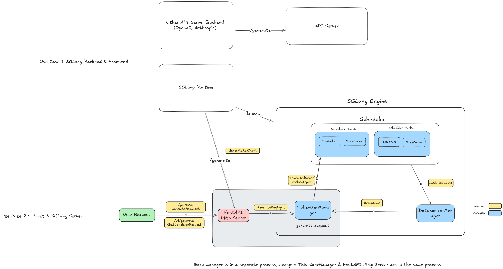

# Entrypoint

1. `launch_server.py`
2. `_launch_subprocesses` : Init `TokenizerManager` , start new processes about: `Scheduler` , `DetokenizerManager` , set `TokenizerManager` globally
   1. `TokenizerManager`
   2. `Scheduler`
   3. `DeTokenizerManager`
3. start `FastAPI Server`

```python
uvicorn.run(
    app,
    host=server_args.host,
    port=server_args.port,
    log_level=server_args.log_level_http or server_args.log_level,
    timeout_keep_alive=5,
    loop="uvloop",
)
```

# FastAPI Http Server

In a most used case: `chat_completion` , there are mainly 2 interfaces for it.

## `/v1/chat/completions`

In this part, the main work that http server need to do is to convert `ChatCompletionRequest` to `GenerateReqInput` as `GenerateReqInput` is a common used input for `SGLang Engine`

1. openai client

> Only can use openai client params. Extra parameters for SRT backend such as `top_k` cannot used

```python
base_url = "http://localhost:8888/v1"
client = OpenAI(base_url=base_url, api_key="dummy api_key")

def chat_completion(messages: List[Dict[str, Any]]) -> str:
    response = client.chat.completions.create(
        messages=messages,
        model="model_name",
        temperature=0.6,
        top_p=0.95,
        max_completion_tokens=1024,
        logprobs=True,
    )
    return response.choices[0].message.content
```

2. requests

> All the params

```python
def raw_chat_completion(messages: List[Dict[str, Any]]) -> str:
    response = requests.post(
        f"{base_url}/chat/completions",
        json={
            "messages": messages,
            "temperature": 0.7,
            "model": "<model_name>",
            "top_p": 0.95,
            "max_completion_tokens": 128,
            "logprobs": True,
            "top_logprobs": 1,
            "top_k": 20,
        },
    )
    return response.json()
```

## `/generate`

```python
def generate_chat_completion(messages: List[Dict[str, Any]]):
    tokenizer = AutoTokenizer.from_pretrained(model_path)
    chat_prompt = tokenizer.apply_chat_template(
        messages, tokenize=False, add_generate_prompt=True
    )
    response = requests.post(
        f"{generate_base_url}/generate",
        json={
            "text": chat_prompt,
            "sampling_params": {
                "temperature": 0.7,
                "top_p": 0.95,
                "max_new_tokens": 128,
                "top_k": 20,
            },
            "return_logprob": True,
            "top_logprobs": 1,
            "return_text_in_logprobs": True,
        },
    )
    data = response.json()
    pprint(data)
```

## communicate to Tokenizer Manager

> The FastAPI server receives requests from the two interfaces above, converts them into `GenerateReqInput` objects, and uses the `TokenizerManager` to tokenize them before forwarding the results to the scheduler on rank 0.

```python
ret = await _global_state.tokenizer_manager.generate_request(
            obj, request
        ).__anext__()
return ret
```

# TokenizerManager

## Init

```python
class TokenizerManager:
    def __init__(server_args, port_args):
        ###################################
        # Init inter-process communication
        ###################################
        context = zmq.asyncio.Context(2)
        # recv res from detokenizer
        self.recv_from_detokenizer = get_zmq_socket(
            context, zmq.PULL, port_args.tokenizer_ipc_name, True
        )
        # send req to scheduler
        self.send_to_scheduler = get_zmq_socket(
            context, zmq.PUSH, port_args.scheduler_input_ipc_name, True
        )

        ##############################
        # Get Tokenizer
        ###########################
        self.tokenizer = get_tokenizer(
                server_args.tokenizer_path,
                tokenizer_mode=server_args.tokenizer_mode,
                trust_remote_code=server_args.trust_remote_code,
                revision=server_args.revision,
            )
```

## Event Loop

```python
class TokenizerManager:
    async def generate_request(obj, request):
        # record req's created time
        created_time = time.time()

        # create working handler loop
        self.auto_create_handle_loop()

        obj.normalize_batch_and_arguments()

        async with self.model_update_lock.reader_lock:
            is_single = obj.is_single
            if is_single:
                # step 1: tokenize => get `TokenizedGenerateReqInput`
                tokenized_obj = await self._tokenize_one_request(obj)

                # step 2:
                # send it to scheduler
                # create a `ReqState` to record this req
                state = self._send_one_request(obj, tokenized_obj, created_time)

                # step 3: wait for `DetokenizerManager` to send back response
                async for response in self._wait_one_response(obj, state, request):
                    yield response
            else:
                async for response in self._handle_batch_request(
                    obj, request, created_time
                ):
                    yield response
```

# Scheduler (Core)

## Init

```python
class Scheduler:
    def __init__(
        server_args,
        port_args,
        gpu_id: int,
        tp_rank: int,
        pp_rank: int,
        dp_rank: Optional[int]):
        ###################################
        # Init inter-process communication
        ###################################
        context = zmq.Context(2)
        # only rank0 receives reqs from `TokenizerManager`
        if self.pp_rank == 0 and self.attn_tp_rank == 0:
            self.recv_from_tokenizer = get_zmq_socket(
                context, zmq.PULL, port_args.scheduler_input_ipc_name, False
            )
            self.send_to_tokenizer = get_zmq_socket(
                context, zmq.PUSH, port_args.tokenizer_ipc_name, False
            )
            # Send to the DetokenizerManager
            self.send_to_detokenizer = get_zmq_socket(
                context, zmq.PUSH, port_args.detokenizer_ipc_name, False
            )
            self.recv_from_rpc = get_zmq_socket(
                context, zmq.DEALER, port_args.rpc_ipc_name, False
            )
        else:
            self.recv_from_tokenizer = None
            self.recv_from_rpc = None
            self.send_to_tokenizer = SimpleNamespace(send_pyobj=lambda x: None)
            self.send_to_detokenizer = SimpleNamespace(send_pyobj=lambda x: None)

        ##################
        # Init Tokenizer
        ##################
        self.init_tokenizer()

        #######################
        # Init TpWorker (GPU)
        #######################
        if self.enable_overlap: TpWorkerClass = TpModelWorkerClient
        else: TpWorkerClass = TpModelWorker
        self.tp_worker = TpWorkerClass(server_args, gpu_id, tp_rank, pp_rank,
            dp_rank,
            nccl_port=port_args.nccl_port,
        )

        # Init memory pool and cache
        self.init_memory_pool_and_cache()

        # Info to scheduler
        # Init running status
        self.waiting_queue: List[Req] = []
        # The running decoding batch for continuous batching
        self.running_batch: ScheduleBatch = ScheduleBatch(reqs=[], batch_is_full=False)
        # The current forward batch
        self.cur_batch: Optional[ScheduleBatch] = None
        # The last forward batch
        self.last_batch: Optional[ScheduleBatch] = None
```

## Event Loop

```python
def event_loop_normal():
    self.result_queue = queue()
    while True:
        # receive `TokenizedGenerateReqInput` from tokenizer
        # broadcast it to other Scheduler Rank
        recv_reqs = self.recv_requests()

        # Create `Req` from `TokenizedGenerateReqInput`
        # Put that Req into `waiting_queue`
        self.process_input_requests(recv_reqs)

        # Get next batch to run
        # Prefill first
        # then Decode
        batch = self.get_next_batch_to_run()

        # set that batch to current forward batch
        self.cur_batch = batch

        # Run it with `tp_worker`
        result = self.run_batch(batch)

        # process the results and then send it to `DetokenizerManager`
        self.process_batch_result(result)

        # set it as last forward batch
        self.last_batch = batch
```

# DetokenizerManager

## Init

```python
class DetokenizerManager:
    """DetokenizerManager is a process that detokenizes the token ids."""

    def __init__(server_args, port_args):
      ##################################
        # Init inter-process communication
        ##################################
        context = zmq.Context(2)
        self.recv_from_scheduler = get_zmq_socket(
            context, zmq.PULL, port_args.detokenizer_ipc_name, True
        )
        self.send_to_tokenizer = get_zmq_socket(
            context, zmq.PUSH, port_args.tokenizer_ipc_name, False
        )

        # Get Tokenizer
        self.tokenizer = get_tokenizer(
                server_args.tokenizer_path,
                tokenizer_mode=server_args.tokenizer_mode,
                trust_remote_code=server_args.trust_remote_code,
                revision=server_args.revision,
            )
```

## Event Loop

```python
def event_loop():
  while True:
        # Receive `BatchTokenIDOut` from `Scheduler`
        recv_obj = recv_from_scheduler.recv_pyobj()

        # Decode it and then create `BatchStrOut`
        output: BatchStrOut = _request_dispatcher(recv_obj)

        # send back to `TokenizerManager`
        send_to_tokenizer.send_pyobj(output)
```
