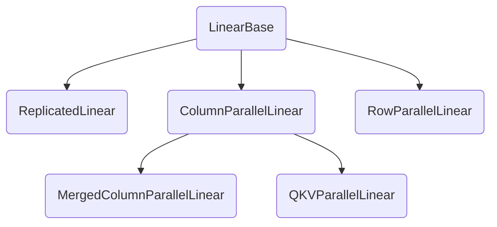

# Model Loading in SGLang

>
> Note: Complex systems often include numerous corner cases and technical implementations that can make the source code challenging to understand for newcomers.
>
> To make the core concepts more accessible, this blog post uses pseudocode that focuses on the main ideas while omitting implementation details (such as self references and other technical specifics). While simplified, the pseudocode maintains the essential logic and workflow of the system.
>
> Of source, if you want to know all details, the best way is to look directly at the source code, which is available in [here](https://github.com/sgl-project/sglang)

Main code walker

`launch_server.py: launch_server` ⇒

`entrypoints/http_server.py: launch_server` ⇒

`entrypoints/engine.py: _launch_subprocesses` ⇒

`managers/scheduler.py: Init Scheduler`  ⇒

`managers/tp_worker.py: Init TpModelWorker` ⇒

`model_executor/model_runner.py: Init ModelRunner` ⇒

`ModelRunner: load_model`

This blog talked about how SGLang

1. Implement Model Architecture
2. Load Model Weights
3. Forward Models

## Load Model

### EntryPoint

```python
class ModelRunner:
  def load_model():

    # get Load Config
    # default: load_format: "auto", download_dir: None
    load_config = LoadConfig(server_args.load_format, server_args.download_dir)

    if server_args.load_format == "gguf": monkey_path_vllm_gguf_config()


     # Remove monkey_patch when linear.py quant remove dependencies with vllm
        monkey_patch_vllm_parallel_state()
        monkey_patch_isinstance_for_vllm_base_layer()

    # Load model
    with memory_saver_adaptor.region():
      model = get_model(
         model_config,
         load_config,
         device_config=DeviceConfig(self.device)
      )

    monkey_patch_vllm_parallel_state(reverse=True)
        monkey_patch_isinstance_for_vllm_base_layer(reverse=True)

    # wait all tp ranks processes to load their corresponding weights
    try:
      dist.monitored_barrier(
                group=get_tp_group().cpu_group,
                timeout=datetime.timedelta(seconds=UNBALANCED_MODEL_LOADING_TIMEOUT_S),
                wait_all_ranks=True,
            )
        except RuntimeError: raise ValueError("....")
```

by calling `get_model`  ⇒ `model_loader/__init__.py`

```python
def get_model(*, model_config, load_config, device_config):
  # create loader from load_config
  loader = get_model_loader(load_config)

  # use that loader to load model using model_config & device_config
  return loader.load_model(model_config, device_config)
```

### Loader (Entrypoint for model initiation & load weights)

this part mainly talks about how to get model loader from `load_conifg`

```python
def get_model_loader(load_config):
  """Get a model loader based on the load format."""

  if load_config.load_format == LoadFormat.DUMMY:
        return DummyModelLoader(load_config)

    if load_config.load_format == LoadFormat.SHARDED_STATE:
        return ShardedStateLoader(load_config)

    if load_config.load_format == LoadFormat.BITSANDBYTES:
        return BitsAndBytesModelLoader(load_config)

    if load_config.load_format == LoadFormat.GGUF:
        return GGUFModelLoader(load_config)

    if load_config.load_format == LoadFormat.LAYERED:
        return LayeredModelLoader(load_config)

    if load_config.load_format == LoadFormat.REMOTE:
        return RemoteModelLoader(load_config)

  # "auto" load_format
    return DefaultModelLoader(load_config)
```

A Loader Object’s main API is `load_model`, the core logic :

1. get a model instance based on the model config
2. load weight from checkpoints

The concrete code logic is as follows:

```python

class DefaultModelLoader(BaseModelLoader):
  def __init__(load_config):
    # actually just set `load_config` to `self.load_config`
    super().__init__(load_config)

  def load_model(*, model_config, device_config):
    # set target device
    target_device = torch.device(device_config.device)

    # set default torch dtype and device
    with set_default_torch_dtype(model_config.dtype):
      with target_device:
        # get model skeleton
        model = _initialize_model(model_config, load_config)

      # load_weight from checkpoints
      load_weights_and_postprocess(
        model,
        _get_all_weights(model_config, model),
        target_device)

    return model.eval() # END, return the MODEL
```

```python
def _initialize_model(model_config, load_config) -> nn.Module:
  # get model implementation based on model_config
  model_class, _ = get_model_architecture(model_config)

  # for quant config
  packed_modules_mapping = getattr(model_class, "packed_modules_mapping", {})
    quant_config = _get_quantization_config(
        model_config, load_config, packed_modules_mapping
    )

  return model_class(
    config=model_config.hf_config,
    quant_config=quant_config
  )
```

### Get Model Architecture

Here is the bridge between `models` and `loader` in runtime

```python
def get_model_architecture(model_config) -> Tuple[Type[nn.Module], str]:
    from sglang.srt.models.registry import ModelRegistry

  # just get hf_config's architectures
    architectures = getattr(model_config.hf_config, "architectures", [])

    # Special handling for quantized Mixtral.
    mixtral_supported = ["fp8", "compressed-tensors", "gptq_marlin", "awq_marlin"]

    if (
        model_config.quantization is not None
        and model_config.quantization not in mixtral_supported
        and "MixtralForCausalLM" in architectures
    ):
        architectures = ["QuantMixtralForCausalLM"]

    return ModelRegistry.resolve_model_cls(architectures)
```

`ModelRegistry`

1. get all model implementions from `models`
2. construct a dict

```python
@dataclass
class _ModelRegistry:
  models: Dict[str, Union[Type[nn.Module], str] = field(default_factory=dict)

  def resolve_model_cls(
        architectures: Union[str, List[str]],
    ) -> Tuple[Type[nn.Module], str]:

      # normalize: just convert one single `str` to `List[str]`
      # if isinstance(architectures, str):
        #     architectures = [architectures]
        architectures = self._normalize_archs(architectures)

        for arch in architectures:
          # arch: str
          # model_cls: nn.Module

            # _try_load_model_cls: models[arch]
            model_cls = self._try_load_model_cls(arch)

            if model_cls is not None:
                return (model_cls, arch)

        return self._raise_for_unsupported(architectures)

@lru_cache()
def import_model_classes():
    model_arch_name_to_cls = {}
    package_name = "sglang.srt.models"
    package = importlib.import_module(package_name)

    # iterate the models
    for _, name, ispkg in pkgutil.iter_modules(package.__path__, package_name + "."):
        if not ispkg:
            try:
                module = importlib.import_module(name)
            except Exception as e:
                logger.warning(f"Ignore import error when loading {name}. " f"{e}")
                continue

            # get EntryClass, which is the real model implementation
            if hasattr(module, "EntryClass"):
                entry = module.EntryClass
                if isinstance(
                    entry, list
                ):  # To support multiple model classes in one module

                    # check duplicate
                    for tmp in entry:
                        assert (
                            tmp.__name__ not in model_arch_name_to_cls
                        ), f"Duplicated model implementation for {tmp.__name__}"

                        # add this implementation into the dict
                        model_arch_name_to_cls[tmp.__name__] = tmp
                else:
                  # check duplicate
                    assert (
                        entry.__name__ not in model_arch_name_to_cls
                    ), f"Duplicated model implementation for {entry.__name__}"

                    # add this implementation into the dict
                    model_arch_name_to_cls[entry.__name__] = entry

    return model_arch_name_to_cls

ModelRegistry = _ModelRegistry(import_model_classes())

```

### Load Weights

1. get_all_weights
2. load those weights

```python
class DefaultModelLoader(BaseModelLoader):
  @dataclass
  class Source:
    """ A source for weights """
    model_or_path: str
    revision: Optional[str]
    prefix: str = ""
    fall_back_to_pt: bool = Ture
    @classmethod
    def init_new(cls, model_config, model):
      return cls(
        model_config.model_path,
        model_config.revision,
        prefix="",
        fall_back_to_pt=getattr(model, "fall_back_to_pt_during_load", True))

  ####################################################
  # [CORE 1] get all weight from model's weights files
  ####################################################
  def _get_all_weights(model_config, model):
    primary_weights = DefaultModelLoader.Source.init_new(model_config, model)
    # yield from parimary weights
    yield from _get_weights_iterator(primary_weights)

    # yield from secondary weights (can be omitted)
    secondary_weights = cast(
            Iterable[DefaultModelLoader.Source], getattr(model, "secondary_weights", ())
        )
        for source in secondary_weights:
            yield from _get_weights_iterator(source)

    def _get_weights_iterator(source):
      # get path of the `hf_weights_files`
      hf_folder, hf_weights_files,  use_safetensors = _prepare_weights(
            source.model_or_path, source.revision, source.fall_back_to_pt
        )

        if load_config.load_format == LoadFormat.NPCACHE:
          ...
      else if use_safetensors:
        # open `hf_weights_files` and iterate its content
        weights_iterator = safetensors_weights_iterator(hf_weights_files)
    else:
            weights_iterator = pt_weights_iterator(hf_weights_files)
        # Apply the prefix.

        # MAIN LOGIC OF GETTING WEIGHTS IS OVER HERE
        return ((source.prefix + name, tensor) for (name, tensor) in weights_iterator)

    def _prepare_weights(
        model_name_or_path: str,
        revision: str,
        fall_back_to_pt: bool) -> Tuple[path, List[str], bool]:

       # if successful, model_name_or_path will be the directory storing weights
       model_name_or_path = _maybe_download_from_modelscope(model_name_or_path, revision)

       # check it is directory, meaning whether this model has been downloaded
       is_local = os.path.isdir(model_name_or_path)

        load_format = load_config.load_format
         use_safetensors = False
         index_file = SAFE_WEIGHTS_INDEX_NAME

         if load_format == LoadFormat.AUTO:
           allow_patterns = ["*.safetensors", "*.bin"]
       ... # other load_format

       if fall_back_to_pt:
            allow_patterns += ["*.pt"]

         if not is_local:
           hf_folder = download_weights_from_hf(
             model_name_or_path,
             load_config.download_dir,
             allow_patterns,
             revision,
             load_config.ignore_patterns)
     else:
       # has been downloaded from modelscope
       hd_folder = model_name_or_path

    # check whether to use safetensors
    hf_weights_files = []
    for pattern in allow_patterns:
      hf_weights_files += glob.glob(os.path.join(hf_folder, pattern))
      if len(hf_weights_files) > 0:
        if pattern == "*.safetensors":
          use_safetensors = True
        break

    # Filter some hf_weights_files
    if use_safetensors:
      if not is_local:
        # using huggingface download instead of modelscope

        download_safetensors_index_file_from_hf(...)
      hf_weights_files = filter_duplicate_safetensors_files(...)
    else:
      hf_weights_files = filter_files_not_needed_for_inference(...)

    return hf_folder, hf_weights_files, use_safetensors

  ##################################################
  # CORE 2: Model Loads Wights
  ##################################################
  @staticmethod
    def load_weights_and_postprocess(model, weights, target_device):
        model.load_weights(weights) # directly load

    # check quant
        for _, module in model.named_modules():
            quant_method = getattr(module, "quant_method", None)
            if quant_method is not None:
                # When quant methods need to process weights after loading
                # (for repacking, quantizing, etc), they expect parameters
                # to be on the global target device. This scope is for the
                # case where cpu offloading is used, where we will move the
                # parameters onto device for processing and back off after.
                with device_loading_context(module, target_device):
                    quant_method.process_weights_after_loading(module)

```

```python
# load weights from hf_weights_files
def safetensors_weights_iterator(hf_weights_files: List[str], ...):
  for st_file in tqdm(
        hf_weights_files,
        desc="Loading safetensors checkpoint shards",
        disable=not enable_tqdm,
        bar_format=_BAR_FORMAT,
    ):
        result = safetensors.torch.load_file(st_file, device="cpu")
        for name, param in result.items():
            yield name, param
```

## Model Definition

Core methods

- `__init__`
- `forward`
- `load_weights`

```python
class LlamaForCausalLM(nn.Module):
  def load_weights(weights: Iterable[Tuple[str, Tensor]]):
    # mapping `weight_name` to `param_name`
    # `weight_name` is from real data
    # `param_name` is SGLang model's setting

    stacked_params_mapping = [
            # (param_name, weight_name, shard_id)
            (".qkv_proj", ".q_proj", "q"),
            (".qkv_proj", ".k_proj", "k"),
            (".qkv_proj", ".v_proj", "v"),
            (".gate_up_proj", ".gate_proj", 0),
            (".gate_up_proj", ".up_proj", 1),
        ]

    # get model's all required parameters
        params_dict = dict(self.named_parameters())

        # iterate the provided weights
        for name, loaded_weight in weights:
          layer_id = get_layer_id(name)

          # First Check special Params
          for param_name, weight_name, shard_id in stacked_params_mapping:
            if weight_name not in name: continue

            # wight_name in the weights data, replace that with `param_name`
            # maping `weight_name` to `param_name`
            name = name.replace(weight_name, param_name)

            if name.endswith(".bias") and name not in params_dict:
                    continue

                # use `param_name` to get its module
                param = params_dict[name]

                # use loader from param to load
                weight_loader = param.weight_loader
                weight_loader(param, loaded_weight, shard_id)

                # this weight has been loaded by special params, so it doesn't need to check the else clause
                break

           # Load Completely Same Name's Params
           else:
             if name in params_dict.keys():
               param = params_dict[name]
               weight_loader = getattre(param, "weight_loader", default_weight_loader)
               weight_loader(param, loaded_weight)
           else:
             warning...
```

以Qwen3ForCausalLM为例

```python
class LlamaForCausalLM(nn.Module):
    def load_weights(self, weights: Iterable[Tuple[str, torch.Tensor]]):
        stacked_params_mapping = [
            # (param_name, shard_name, shard_id)
            ("qkv_proj", "q_proj", "q"),
            ("qkv_proj", "k_proj", "k"),
            ("qkv_proj", "v_proj", "v"),
            ("gate_up_proj", "gate_proj", 0),
            ("gate_up_proj", "up_proj", 1),
        ]

        params_dict = dict(self.named_parameters())
        for name, loaded_weight in weights:
            if "rotary_emb.inv_freq" in name or "projector" in name:
                continue
            if "rotary_emb.cos_cached" in name or "rotary_emb.sin_cached" in name:
                # Models trained using ColossalAI may include these tensors in
                # the checkpoint. Skip them.
                continue
            if self.config.tie_word_embeddings and "lm_head.weight" in name:
                continue
            if name.startswith("model.vision_tower") and name not in params_dict:
                continue

            for param_name, weight_name, shard_id in stacked_params_mapping:
                if weight_name not in name:
                    continue
                name = name.replace(weight_name, param_name)
                # Skip loading extra bias for GPTQ models.
                if name.endswith(".bias") and name not in params_dict:
                    continue
                param = params_dict[name]
                weight_loader = param.weight_loader
                weight_loader(param, loaded_weight, shard_id)
                break
            else:
                # Skip loading extra bias for GPTQ models.
                if name.endswith(".bias") and name not in params_dict:
                    continue
                param = params_dict[name]
                weight_loader = getattr(param, "weight_loader", default_weight_loader)
                weight_loader(param, loaded_weight)

```

### Model Config

**`Context Length`**

```python
CONTEXT_LENGTH_KEYS = [
    "max_sequence_length",
    "seq_length",
    "max_seq_len",
    "model_max_length",
    "max_position_embeddings",
]

def get_context_length(config):
    """Get the context length of a model from a huggingface model configs."""
    text_config = config
    rope_scaling = getattr(text_config, "rope_scaling", None)
    if rope_scaling:
        rope_scaling_factor = rope_scaling.get("factor", 1)
        if "original_max_position_embeddings" in rope_scaling:
            rope_scaling_factor = 1
        if rope_scaling.get("rope_type", None) == "llama3":
            rope_scaling_factor = 1
    else:
        rope_scaling_factor = 1

    for key in CONTEXT_LENGTH_KEYS:
        val = getattr(text_config, key, None)
        if val is not None:
            return int(rope_scaling_factor * val)
    return 2048
```

## Layer

`python/sglang/srt/layers`

1. 重要的layers定义在`python/sglang/srt/layers/*`
    1. attention: 实现attention算子
    2. sample.py

### Method: create_weights & apply(forward)

create a new abstract called `QuantizeMethod`

```python
class QuantizeMethodBase(ABC):
    """Base class for different quantized methods."""

    @abstractmethod
    def create_weights(
        self, layer: torch.nn.Module, *weight_args, **extra_weight_attrs
    ):
        """Create weights for a layer.

        The weights will be set as attributes of the layer."""
        raise NotImplementedError

    @abstractmethod
    def apply(self, layer: torch.nn.Module, *args, **kwargs) -> torch.Tensor:
        """Apply the weights in layer to the input tensor.

        Expects create_weights to have been called before on the layer."""
        raise NotImplementedError

    def process_weights_after_loading(self, layer: nn.Module) -> None:
        """Process the weight after loading.

        This can be used for example, to transpose weights for computation.
        """
        return
```

A simple methods used for linear layers is as follows:

```python
class UnquantizedLinearMethod:
  def create_weights(
    layer: nn.Module,
    input_size_per_partition: int,
    output_partition_sizes: List[int],
    ...
    params_dtype: torch.dtype,
    **extra_weight_attrs):

    # create a parameter
    weight = Parameter(
      torch.empty(
        sum(output_partition_sizes),
        input_size_per_partition,
        dtype=params_dtype),
      requires_grad=False)

    # set attributes to that parameter
    set_weight_attrs(weight, {"input_dim": 1, "output_dim": 0})

    # register parameters
    layer.register_parameter("weight", weight)
    set_weight_attrs(weight, extra_weight_attrs)

  def apply(layer, x, bias=None):
    return F.linear(x, layer.weight, bias)
```

by setting weight(`nn.Parameter()`) attributes, each weight has its own loader to load weights from checkpoints

```python
def set_weight_attrs(weight, weight_attrs):
  if weight_attrs is None: return
  for key, value in weight_attrs.items():
    assert not hasattr(weight, key), f"Overwriting existing tensor attribute: {key}"
        setattr(weight, key, value)
```

### Parameters

There are many types of parameters in LLMs, but the core is `linear` , so here we take linear layer as an example to illustrate how `SGLang` create parameters and loaded weights from checkpoints, the rest parameter is similar



```python
class LinearBase(nn.Module):
  # this class is used for setting attributes and get quant_method
  def __init__(
    input_size: int,
        output_size: int,
        skip_bias_add: bool = False,
        params_dtype: Optional[torch.dtype] = None,
        quant_config: Optional[QuantizationConfig] = None,
        prefix: str = "",
  ):
    super().__init__()

    # set the first 4 args to this class

    if quant_config is None:
      self.quant_method = UnquantizedLinearMethod()
    else:
      self.quant_method = quant_config.get_quant_method(self, prefix=prefix)

  def forward(x):
    raise NotImplementedError
```

`ReplicatedLinear`: directly load the whole weights

```python
class ReplicatedLinear(LinearBase):
  def __init__(...):
   super().__init__(
     input_size,
     output_size,
     skilp_bias_add,
     params_dtype,
     quant_config,
     prefix=prefix)

   # 1. create a param
   # 2. add `weight_loader` to that param
   # 3. register that param to self
   self.quant_method.create_weights(
     self,
     self.input_size,
     [self.output_size],
     ...
     self.params_dtype,
     self.weight_loader
   )

  def weight_loader(param: Parameter, loaded_weight: Tensor):
    assert param.size() == loaded_weight.size()
    param.copy_(loaded_weight)

  def forward(x):
    # use quant_method to forward
    output = quant_method.apply(self, x, bias)

    output_bias = self.bias if self.skip_bias_add else None
    return output, output_bias
```

`ColumnParallelLinear`: divide the weights by `output_dim`

```python
class ColumnParallelLinear(LinearBase):
  def __init__(
        self,
        input_size: int,
        output_size: int,
        bias: bool = True,
        gather_output: bool = False,
        skip_bias_add: bool = False,
        params_dtype: Optional[torch.dtype] = None,
        quant_config: Optional[QuantizationConfig] = None,
        output_sizes: Optional[List[int]] = None,
        prefix: str = "",

        tp_rank: Optional[int] = None, # used for division
        tp_size: Optional[int] = None,

        use_presharded_weights: bool = False,
    ):
      super().__init__(
            input_size,
            output_size,
            skip_bias_add,
            params_dtype,
            quant_config,
            prefix
        )

        # Divide the weight matrix along the last dimension.
        if tp_rank is None: tp_rank = get_tensor_model_parallel_rank()
        if tp_size is None: tp_size = get_tensor_model_parallel_world_size()

        # output_size // tp_size
        output_size_per_partition = divide(output_size, tp_size)

        output_partition_sizes = [output_size_per_partition]

        # If QKV or MergedColumn, use output size of each partition.
        # FIXME
        if hasattr(self, "output_sizes"):
            output_partition_sizes = [
                divide(output_size, tp_size)
                  for output_size in self.output_sizes
            ]

        if output_sizes is None:
            output_sizes = [output_size]
        # FIXME

        quant_method.create_weights(
          layer=self,
          input_size,
            output_partition_sizes,

            # these are not used
            input_size=self.input_size,
            output_size=self.output_size,
            # ...

            params_dtype=self.params_dtype,

            # these are added into param
            weight_loader=(
                self.weight_loader_v2
                if self.quant_method.__class__.__name__ in WEIGHT_LOADER_V2_SUPPORTED
                else self.weight_loader
            ),
         )
        )
        if bias:
          self.bias = Parameter(
                torch.empty(output_size_per_partition, dtype=params_dtype)
            )
            set_weight_attrs(
                self.bias,
                {
                    "output_dim": 0,
                    "weight_loader": self.weight_loader,
                },
            )
        else:
          self.register_parameter("bias", None)

  def weight_loader(param, loaded_weight: Tensor):
    # get output_dim
    output_dim = getattr(param, "output_dim", None)

    param_data = param.data
    if output_dim is not None:
      # get this part shard_size
      shard_size = param_data.shape[output_dim]

      # locate idx
      start_idx = shard_size * tp_rank

      # get shard weight from the loaded_weight
      loaded_weight = loaded_weight.narrow(
        output_dim,
        start_idx,
        shard_size)

    assert param_data.shape == loaded_weight.shape

    param_data.copy_(loaded_weight)


  def forward(input_):
        bias = self.bias if not self.skip_bias_add else None

    # use that method to forward
    output_parallel = quant_method.apply(self, input_, bias)

    # whether to gather different column results
    if gather_out: output = tensor_model_parallel_all_gather(output_parallel)
    else: output = output_parallel

    output_bias = self.bias if self.skip_bias_add else None

    return output, output_bias
```

`MergedColumnParallelLinear` doens’t have a very difference with `ColumnParallelLinear`, it usage is just add two `output_sizes` which is a List `[a, b]` into one `ColumnParallelLinear` , getting a wider matrix (`sum(a, b)`), and it also loads weights from different loaded_weights

```python
class MergedColumnParallelLinear(ColumnParallelLinear):
  def __init__(...): pass

  def weight_loader(param, loaded_weight, loaded_shard_id=None):
    param_data = param.data
        output_dim = getattr(param, "output_dim", None)

        if output_dim is not None:
          shard_offset = (sum(output_sizes[:loaded_shard_id]) // tp_size)
          shard_size = output_sizes[loaded_shard_id] // tp_size

      # narrow
      param_data = param_data.narrow(output_dim, shard_offset, shard_size)

      start_idx = tp_rank * shard_size
      loaded_weight = loaded_weight.narrow(output_dim, start_idx, shard_size)

    param_data.copy_(loaded_weight)
```

`QKVParallelLinear` has a similar behavior.

but it uses `total_num_heads // tp_size` to devide columns of weights

```python
class QKVParallelLinear(ColumnParallelLinear):
  def __init__(self,
    hidden_size,
    head_size,
    total_num_heads,
    total_num_kv_heads,
    bias,
    skil_bias_add,
    params_dtype,
    quant_config,
    prefix,
    tp_rank,
    tp_size,
    load_preshared_attn):

    # get tp info
    if tp_rank is None: tp_rank = get_tensor_model_parallel_rank()
    if tp_size is None: tp_size = get_tensor_model_parallel_world_size()

    num_heads = divide(total_num_heads, tp_size)
    if tp_size >= total_num_kv_heads:
      num_kv_heads = 1
      num_kv_head_replicas = divide(tp_size, total_num_kv_heads)
    else:
      num_kv_heads = divide(total_num_kv_heads, tp_size)
      num_kv_head_replicas = 1

    # get input_size & output_size
    input_size = hidden_size

    # NOTE: why multiply `tp_size`, because in `ColumnParallelLinear`
    # output_size needs being divided by `tp_size`, then it would be a normal shape
    output_size = (num_heads + 2 * num_kv_heads) * tp_size * head_size

    super().__init__(
      input_size,
      output_size,
      bias,
      gather_output=False,
      skil_bias_add,
      ...
    )

  def weight_loader():
    output_dim = getattr(param, "output_dim", None)
    param_data = param.data

    shard_size = param_data.shape[output_dim]

    assert loaded_shard_id in ["q", "k", "v"]


    ################################################
    # Param Weight: | q_shard | k_shard | v_shard |
    ################################################
    if output_dim is not None:
      if loaded_shard_id == "q":
        shard_offset = 0
        shard_size = num_heads * head_size
      elif loaded_shard_id == "k":
        shard_offset = num_heads * head_size
        shard_size = num_kv_heads * head_size
      elif loaded_shard_id == "v":
        shard_offset = (num_heads + num_kv_heads) * head_size
        shard_size = num_kv_heads * head_size

      # get that shard from param
      param_data = param_data.narrow(output_dim, shard_offset, shard_size)

      # get real shard weight from checkpoints
      if load_shard_id == "q": shard_id = tp_rank
      else: shard_id = tp_rank // num_kv_head_replicas

      start_idx = shard_id * shard_size

      loaded_weight.narrow(output_dim, start_idx, shard_size)

   param_data.copy_(loaded_weight)

```

`RowParallelLinear` : above column linear layers only split results, doesn’t gather, `RowParallelLinear` is the part to reduce results

```python
class RowParallelLinear(LinearBase):
  def __init__(self,
    input_size: int,
    output_size: int,
    bias: bool = True,
    input_is_parallel: bool = False,
    skil_bias_add: bool = False,
    params_dtype = None,
    reduce_results: bool = True, # by default `reduce_results` is True
    quant_config = None,
    prefix: str = "",
    tp_rank = None,
    tp_size = None,
    use_preshared_weights: bool = False):

    # get quant_method
    super().__init__(...)

    if tp_rank is None: tp_rank = get_tensor_model_parallel_rank()
        if tp_size is None: tp_size = get_tensor_model_parallel_world_size()

    input_size_per_partition = divide(input_size, tp_size)

    # create weights using the quant_method
    quant_method.create_weights(
            layer=self,
            input_size_per_partition=input_size_per_partition,
            output_partition_sizes=[output_size],
            ...
            params_dtype=params_dtype,
            weight_loader=(
                self.weight_loader_v2
                if self.quant_method.__class__.__name__ in WEIGHT_LOADER_V2_SUPPORTED
                else self.weight_loader
            ),
        )

        if bias:
          self.bias = Parameter(torch.empty(output_size), dtype=params_dtype)
          set_weight_attrs(self.bias, {"output_dim": 0, "weight_loader": self.weight_loader})
      else:
        self.register_parameter("bias", None)

  def forward(self, input_):
    input_parallel = input_

    # Only fuse bias add into GEMM for rank 0 (this ensures that
        # bias will not get added more than once in TP>1 case)
        bias_ = None if (self.tp_rank > 0 or self.skip_bias_add) else self.bias
        output_parallel = self.quant_method.apply(self, input_parallel, bias=bias_)
        if self.reduce_results and self.tp_size > 1:
            output = tensor_model_parallel_all_reduce(output_parallel)
    else:
      output = output_parallel

      output_bias = self.bias if self.skip_bias_add else None
        return output, output_bias
```
